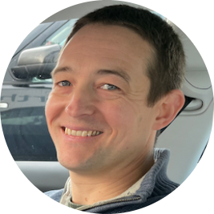

I hold a PhD in physics from the University of Cambridge and have worked in a number of research and development roles within industry. I currently work as a senior data scientist at [Satellite Vu](https://www.satellitevu.com/) where I apply cutting edge deep learning techniques to remote sensing imagery. I have a decade of experience with the Python programming language and have expertise in cloud computing on AWS infrastructure. I am a passionate advocate for the open source software movement and make regular contributions on [Github](https://github.com/robmarkcole). I have presented at Python conferences and appeared on podcasts including the [ZenML podcast](https://podcast.zenml.io/satellite-vision-robin-cole). I am the maintainer of the [satellite-image-deep-learning](https://github.com/robmarkcole/satellite-image-deep-learning) Github repository and curate the [satellite-image-deep-learning group on LinkedIn](https://www.linkedin.com/groups/12698393/)